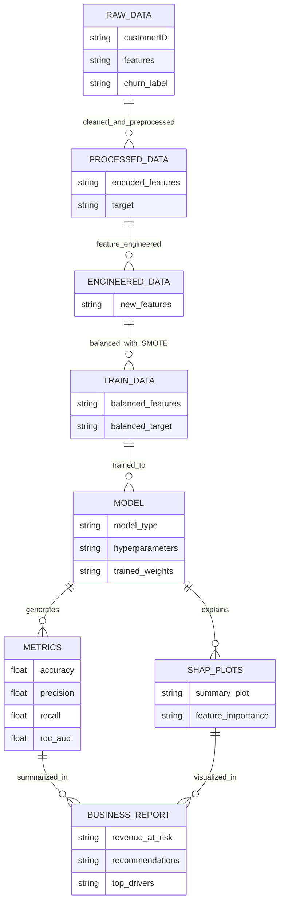

# PrediChurn 🚦 – End-to-End Customer Churn Prediction Suite

> _"Transforming churn risk into retention strategies with advanced ML."_  
> 🔍 Powered by: **XGBoost**, **Random Forest**, **Optuna**, **SHAP**  
> 🧑💻 Engineered by: **vishnupriyanpr**


---

## Overview 🚀 

**PrediChurn** is a robust, modular machine learning pipeline for customer churn prediction. Designed for telecom, SaaS, and banking datasets, it automates data wrangling, business-driven feature engineering, model selection, evaluation, and produces clear business insights and analytics dashboards. Its outputs guide retention teams toward targeted, ROI-driven customer strategies.

---

## Key Features 🧠

- 🔄 Multi-model engine: Logistic Regression, Random Forest, XGBoost—all Optuna-optimized
- 🛠️ Feature engineering: Tenure, ARPU, contract/payment, and behavior features with full NaN/infinite safety
- 🔍 Explainable AI: SHAP for both global and local churn driver visualization
- 📊 Business metrics: Churn rate, “revenue at risk”, “potential revenue saved”, intervention ROI
- 📑 Automated reporting: Executive summaries, actionable recommendations, and visualization outputs

---

## ML Pipeline Details 🏗️

**1. Data Preparation**
  - Loads raw CSV data
  - Cleans missing values and outliers
  - Encodes categoricals
  - Scales numerical data

**2. Feature Engineering**
  - Generates >10 additional business-focused features (e.g., avg_charges_per_tenure, high_value_customer)
  - Handles division-by-zero/NaN/infinite edge cases

**3. Modeling and Optimization**
  - Trains Logistic Regression, Random Forest, and XGBoost models
  - Balances training data with SMOTE for rare churn events
  - Hyperparameter tuning via Optuna for best ROC-AUC

**4. Evaluation**
  - Measures: accuracy, precision, recall, ROC-AUC
  - Generates confusion matrix, ROC, Precision-Recall plots

**5. Explainability**
  - Computes and saves SHAP summary and bar plots
  - Ranks top churn features both globally and per-customer

**6. Business Analytics**
  - Calculates "revenue at risk", "potential savings", intervention efficiency
  - Generates markdown and visual HTML reports
  - Top churn drivers and segment-wise actionable steps

---

## Workflow 🔁

1. **Clone Project & Install**
    ```
    git clone https://github.com/vishnupriyanpr/churnguard-ai.git
    cd churnguard-ai
    pip install -r requirements.txt
    ```

2. **Prepare Dataset**
    - Place your CSV data in `data/raw/telco_churn.csv` (Kaggle Telco Churn format recommended)

3. **Run Pipeline**
    ```
    python main.py
    ```

4. **View Outputs**
    - Metrics, SHAP PNGs, and business report: in `reports/`
    - Model artifacts: in `models/`
---
## Workflow ER Diagram 🗺️




---

## Key Results (Latest Run) 📊 

- **Accuracy:** 78.1%
- **Precision:** 57.9%
- **Recall:** 65.0%
- **ROC-AUC:** 0.822
- **Churn Rate:** 26.5%
- **Revenue at Risk:** $374,000
- **Potential Revenue Saved:** $72,900
- **Intervention Efficiency:** 57.2%
- **Top Churn Drivers:**  
    - avg_charges_per_tenure (0.132)  
    - MonthlyCharges (0.083)  
    - charges_trend (0.076)  
    - TotalCharges (0.076)  
    - price_per_month_ratio (0.075)

---

## 🧾 Business Recommendations

1. **Immediate Action:** Target high-risk (churn prob > 70%) with retention offers
2. **Monitor Medium-Risk:** Engage the 30–70% churn probability group
3. **Feature Focus:** Optimize avg_charges_per_tenure and related drivers
4. **Ongoing Scoring:** Recompute churn risk monthly for all customers

---

## Project Structure 📁 
```bash
churnguard-ai/
├── data/
│ ├── raw/
│ └── processed/
├── models/
├── reports/
├── src/
│ ├── data_loader.py
│ ├── data_preprocessor.py
│ ├── feature_engineer.py
│ ├── model_trainer.py
│ ├── model_evaluator.py
│ └── utils.py
├── main.py
├── requirements.txt
└── README.md

```
---

## Output  🖼 


<p align = 'center'>
<div style="display: flex; justify-content: center; gap: 1px; align-items: flex-start;">
  
  
</div>
</p>


---

## License 📜 

MIT License — use, modify, and scale freely!

## Credits 🙌
<div align="center">
  <table style="width:100%;">
    <tr>
      <td align="center" style="width:50%;">
        <a href="https://github.com/vishnupriyanpr">
                  
      </a>
      </td>
      <td align="center" style="width:50%;">
        <blockquote>
          <p>“Tools should disappear into the background and let you build.”</p>
          <footer>— Vishnupriyan P R, <i>caffeinated coder ☕</i></footer>
        </blockquote>
      </td>
    </tr>
  </table>
</div>


